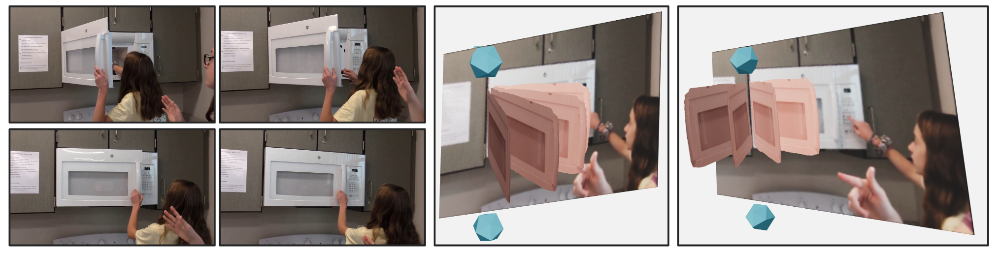

# Understanding 3D Object Articulation in Internet Videos

Code release for our paper

```
Understanding 3D Object Articulation in Internet Videos
Shengyi Qian, Linyi Jin, Chris Rockwell, David Fouhey
```



Please check the [project page](https://jasonqsy.github.io/Articulation3D/) for more details and consider citing our paper if it is helpful:

## Setup

We're using [pyenv](https://github.com/pyenv/pyenv) to set up the anaconda environment.

```bash
VERSION_ALIAS="planercnn" PYTHON_CONFIGURE_OPTS="--enable-shared" pyenv install anaconda3-2020.11
```

To install python packages,

```bash
# pytorch and pytorch3d
pip install scikit-image matplotlib imageio plotly opencv-python
conda install -c pytorch pytorch=1.7.1 torchvision cudatoolkit=10.2
conda install -c fvcore -c iopath -c conda-forge fvcore iopath
conda install -c bottler nvidiacub
conda install pytorch3d -c pytorch3d

# detectron2 with pytorch 1.7, cuda 10.2
python -m pip install detectron2 -f https://dl.fbaipublicfiles.com/detectron2/wheels/cu102/torch1.7/index.html

# other packages
pip install mapbox-earcut
pip install numpy-quaternion
pip install --upgrade numpy  # upgrade from 1.19 to 1.20, otherwise numpy-quaternion does not work
pip install imageio-ffmpeg

# install planercnn
cd planercnn
pip install -e .
```

## Demo

To run the model on a single image,

```bash
tbd
```

To run both the model and temporal optimization on a video, 

```bash
tbd
```

## Experiments 

To be released.

## Acknowledgment

We reuse the codebase of [SparsePlanes](https://github.com/jinlinyi/SparsePlanes) and [Mesh R-CNN](https://github.com/facebookresearch/meshrcnn).
